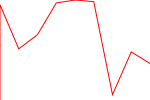

# ChartGen
super simple svg chart generating library in Rust.

Example.rs:
```rust
extern crate chartgen;
use chartgen::{generate_svg, truncate_chart, Point};

fn main() {
    let points: Vec<Point<f64>> = Vec::from([
        Point { x: 0.0, y: 0.0 },
        Point { x: 0.0, y: 9020.0 },
        Point { x: 1.0, y: 4845.0 },
        Point { x: 2.0, y: 6189.0 },
        Point { x: 3.0, y: 9190.0 },
        Point { x: 4.0, y: 9471.0 },
        Point { x: 5.0, y: 9313.0 },
        Point { x: 6.0, y: 504.0 },
        Point { x: 7.0, y: 4555.0 },
        Point { x: 8.0, y: 3455.0 },
    ]);
    let size = Point { x: 150.0, y: 100.0 };
    println!(
        "{}",
        generate_svg(&truncate_chart(&points, size), size, String::from("red"), String::from("2"))
    );
}
```
Results in:
```xml
<svg xmlns="http://www.w3.org/2000/svg" width="150" height="100" viewbox="0 0 150 100"><polyline fill="none" stroke="red" points="0.00,100.00 0.00,4.76 18.75,48.84 37.50,34.65 56.25,2.97 75.00,0.00 93.75,1.67 112.50,94.68 131.25,51.91 150.00,63.52 "/></svg>
```
Or

